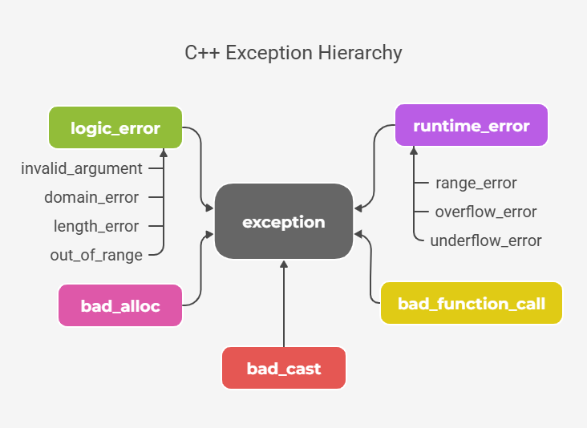

> Mistakes that cause unusual conditions (errors) are common. These errors generally fall into three categories:

- Syntax Errors – Violations of language rules (caught during compilation).
- Logical Errors – Code runs but produces incorrect results due to wrong logic.
- Runtime Errors – Unexpected errors that occur during program execution (e.g., division by zero).

# Exception Handling

It is a mechanism to detect and manage runtime errors in a structured way.

C++ allows you to `throw` exceptions and `catch` them for graceful handling.

uses `try` and `catch` blocks, where `try` contains the code that may throw an exception, and `catch` contains the code to handle it.

## How Exception Handling Works in C++

1. Throwing an Exception

2. Catching an Exception

3. Handling the Exception

## Throwing Exception

 Throwing exception means returning some kind of value that represent the exception from the `try block`. The matching catch block is found using the type of the `thrown` value. The throw keyword is used to throw the exception.

``` C++
try {         
    throw val
} 
catch (ExceptionType e) {   
    // exception handling code
}
```

There are three types of values that can be thrown as an exception:

- Built-in Types
- Standard Exceptions
- Custom Exceptions

## Throwing Standard Exceptions


